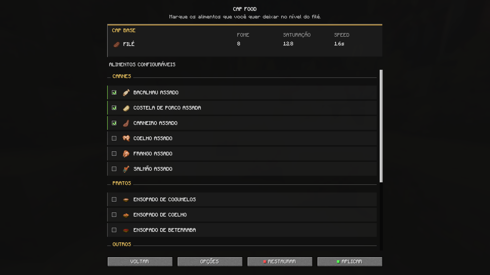

# CAP FOOD

Raise your favorite foods to steak level. CAP FOOD lets you choose which supported foods receive a shared standard of 8 hunger points, 12.8 saturation, and a 1.6-second eating speed. Its clean, vanilla-style interface is integrated with Mod Menu, organizes foods by category, and keeps every choice saved between sessions, **making the experience easy to configure without changing how Minecraft feels**.

CAP FOOD exists to make **food choice about preference instead of efficiency**. When steak is simply stronger, many charming foods are left behind—not because players dislike them, but because choosing them comes with a disadvantage. We wanted cooked chicken, honey bottles, stews, and other overlooked foods to feel genuinely viable, **giving familiar items new purpose while bringing more variety and life** to everyday survival.

## Foods available for CAP

**Meats:** Cooked Cod, Cooked Porkchop, Cooked Mutton, Cooked Rabbit, Cooked Chicken, and Cooked Salmon.

**Dishes:** Mushroom Stew, Rabbit Stew, and Beetroot Soup.

**Others:** Baked Potato, Cookie, Cake, Honey Bottle, Apple, Bread, and Pumpkin Pie.

## Features built for gameplay

| Selection and configuration | Gameplay support |
| --- | --- |
| Apply CAP individually or toggle all 16 foods at once. | Hold `Shift` to inspect effective hunger, saturation, and speed values. |
| Configure global options and save changes when applied. | Apply CAP to cake in the inventory and to slices eaten after placement. |
| Use the interface in Portuguese or English. | Optionally consume returned containers, including bowls and bottles. |
