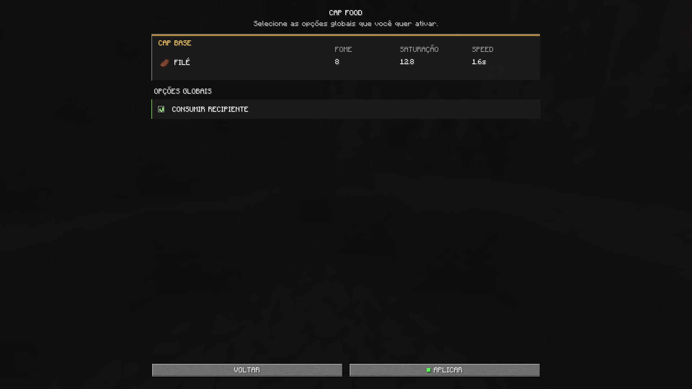

# CAP FOOD

Raise your favorite foods to steak level.

**CAP FOOD** lets you choose which foods use the CAP standard:

- **Hunger:** 8 points — 4 drumsticks
- **Saturation:** 12.8
- **Speed:** 1.6 seconds

Your choices are made through a simple interface integrated with **Mod Menu** and remain saved between sessions.

On the first installation, all supported foods start selected to receive CAP while all global options remain disabled.

## Foods available for CAP

### Meats

- Cooked Cod
- Cooked Porkchop
- Cooked Mutton
- Cooked Rabbit
- Cooked Chicken
- Cooked Salmon

### Dishes

- Mushroom Stew
- Rabbit Stew
- Beetroot Soup

### Others

- Baked Potato
- Cookie
- Cake
- Honey Bottle
- Apple
- Bread
- Pumpkin Pie

## Interface

## Features

- 16 supported foods organized by category.
- Individual application of the CAP standard.
- Global option to show the effective hunger, saturation, and speed values by holding `Shift` over supported foods and steak.
- Support for cake in the inventory and slices eaten after it is placed.
- Global option to consume returned containers from supported foods, including bowls and bottles.
- Select or clear all foods with a single button.
- Configuration saved automatically when applied.
- Interface available in Portuguese and English.

## Requirements

- Minecraft **26.2**
- Java **25** or newer
- Fabric Loader **0.19.3** or newer
- Fabric API
- Mod Menu **20.0.1** or newer — required dependency

## Installation

1. Install compatible versions of Fabric Loader, Fabric API, and Mod Menu.
2. Place the CAP FOOD `.jar` file in the instance's `mods` folder.
3. Open **Mods → CAP FOOD**.
4. Select the foods you want and choose **APPLY**.

## Compatibility

CAP FOOD is a **client-side mod focused on singleplayer worlds**. In singleplayer, Minecraft's integrated server applies the changes normally.

On external multiplayer servers, hunger and saturation are controlled by the server. Installing CAP FOOD only on the client does not change the foods' effective values in that environment.
