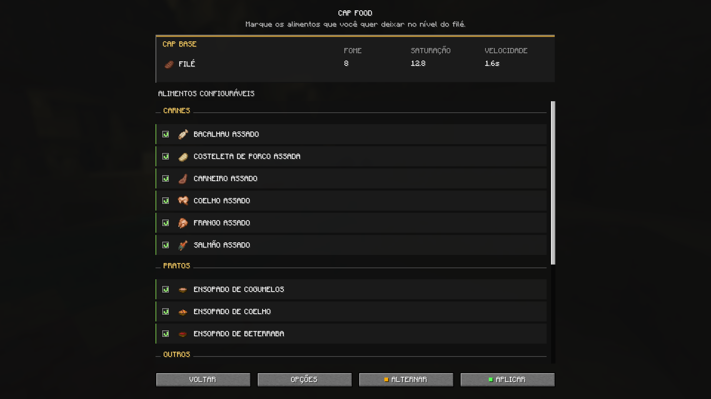

# CAP FOOD
Eleve seus alimentos favoritos ao nível do filé. O CAP FOOD permite escolher quais alimentos compatíveis recebem um padrão compartilhado de 8 pontos de fome, 12,8 de saturação e uma velocidade de consumo de 1,6 segundo. Sua interface limpa, em estilo vanilla, é integrada ao Mod Menu, organiza os alimentos por categoria e mantém todas as escolhas salvas entre as sessões, **tornando a experiência fácil de configurar sem mudar a essência do Minecraft**.

O CAP FOOD existe para fazer com que **a escolha dos alimentos seja uma questão de preferência, não de eficiência**. Quando o filé é simplesmente mais forte, muitos alimentos cheios de personalidade acabam deixados de lado — não porque os jogadores não gostem deles, mas porque escolhê-los traz uma desvantagem. Queríamos que frango assado, frascos de mel, ensopados e outros alimentos pouco aproveitados fossem opções realmente viáveis, **dando um novo propósito a itens familiares e trazendo mais variedade e vida** à sobrevivência cotidiana.

## Alimentos disponíveis para aprimorar
|  |  |
| --- | --- |
| Carnes | Bacalhau assado, Costeleta de porco assada, Carneiro assado, Coelho assado, Frango assado e Salmão assado. |
| Pratos | Ensopado de cogumelos, Ensopado de coelho e Sopa de beterraba. |
| Outros | Batata assada, Biscoito, Bolo, Frasco de mel, Maçã, Pão e Torta de abóbora. |

## Recursos criados para gameplay
|  |  |
| --- | --- |
| Variedade | Entre 16 opções disponíveis, escolha quais alimentos você deseja aprimorar. |
| Propriedades | Segure Shift para consultar os valores efetivos de fome, saturação e velocidade. |
| Bolo | Aplique o CAP ao bolo no inventário e às fatias comidas depois de colocado. |
| Recipientes | Opcionalmente, consuma os recipientes devolvidos, incluindo tigelas e frascos. |
| Idioma | Use a interface em português ou inglês. |